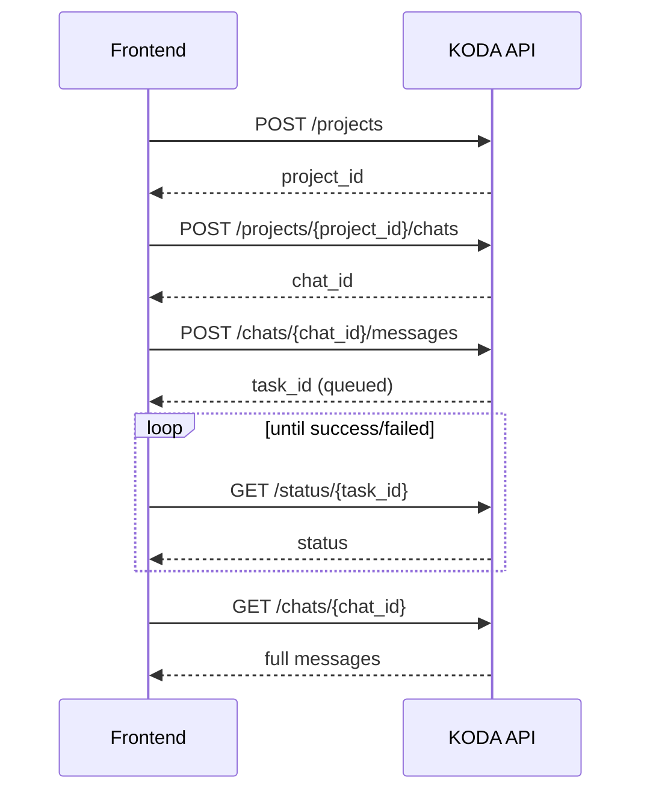

# KODA API Documentation

Knowledge Oriented Developer Agent — REST API reference for frontend integration.

- **Base URL:** `http://<host>:<port>`
- **API prefix:** All endpoints (except `/health`) are under `/api/v1`
- **Content-Type:** `application/json`

---

## Table of Contents

1. [Authentication / Identity](#authentication--identity)
2. [Conventions](#conventions)
3. [Health](#health)
4. [Projects](#projects)
5. [Chats](#chats)
6. [Messages](#messages)
7. [Task Status (Polling)](#task-status-polling)
8. [Resume (Approvals & Plan Review)](#resume-approvals--plan-review)
9. [Run (Stateless Single-Shot)](#run-stateless-single-shot)
10. [Coordinate (Multi-Worker)](#coordinate-multi-worker)
11. [Typical Frontend Flow](#typical-frontend-flow)
12. [Data Models](#data-models)

---

## Authentication / Identity

Identity is passed via HTTP headers. Both default to `"default"` if omitted.

| Header       | Required | Default     | Description              |
| ------------ | -------- | ----------- | ------------------------ |
| `X-Org-Id`   | No       | `default`   | Organization identifier  |
| `X-User-Id`  | No       | `default`   | User identifier          |

> Identity headers are used for ownership/scoping of projects and chats. Send them on **all** project/chat/message requests so resources are correctly scoped to the user.

---

## Conventions

- **Async execution:** Agent runs (`/run`, `POST /chats/{chat_id}/messages`) are executed in the background. These endpoints return a `task_id` immediately with `status: "queued"`. Poll [`GET /status/{task_id}`](#task-status-polling) for the result.
- **Task TTL:** Task results are retained for **1 hour** in Redis.
- **IDs:**
  - `thread_id` / `chat_id` format: `{org_id}:{user_id}:{uuid}`
  - `task_id`: plain UUID
- **Status values (task):** `queued`, `running`, `success`, `failed`, `not_found`

---

## Health

### `GET /health`

Liveness check. No auth required.

**Response `200`**

```json
{ "status": "ok" }
```

---

## Projects

A project binds a workspace path to an org/user. Chats live inside projects.

### `POST /api/v1/projects`

Create a project.

**Request body**

```json
{
  "name": "My App",
  "workspace_path": "/workspace/my-app"
}
```

| Field            | Type   | Required | Notes                  |
| ---------------- | ------ | -------- | ---------------------- |
| `name`           | string | Yes      | Must not be empty      |
| `workspace_path` | string | Yes      | Must not be empty      |

**Response `200`**

```json
{
  "project_id": "uuid",
  "name": "My App",
  "workspace_path": "/workspace/my-app",
  "created_at": "2026-06-27T12:00:00Z"
}
```

**Errors:** `422` if `name` or `workspace_path` is empty.

---

### `GET /api/v1/projects`

List all projects for the identity.

**Response `200`**

```json
[
  {
    "project_id": "uuid",
    "name": "My App",
    "workspace_path": "/workspace/my-app",
    "created_at": "2026-06-27T12:00:00Z"
  }
]
```

---

### `GET /api/v1/projects/{project_id}`

Get a single project, including chat count.

**Response `200`**

```json
{
  "project_id": "uuid",
  "name": "My App",
  "workspace_path": "/workspace/my-app",
  "created_at": "2026-06-27T12:00:00Z",
  "chat_count": 3
}
```

**Errors:** `404` if project not found / not owned by identity.

---

## Chats

A chat is a persistent conversation thread within a project. `chat_id` is the same as the underlying `thread_id`.

### `POST /api/v1/projects/{project_id}/chats`

Create a new chat in a project.

**Request body:** _none_

**Response `200`**

```json
{
  "chat_id": "org:user:uuid",
  "project_id": "uuid",
  "title": null,
  "created_at": "2026-06-27T12:00:00Z"
}
```

> `title` is `null` until the first message is sent (the first message becomes the title).

**Errors:** `404` if project not found.

---

### `GET /api/v1/projects/{project_id}/chats`

List chats in a project.

**Response `200`**

```json
[
  {
    "chat_id": "org:user:uuid",
    "title": "Fix the login bug",
    "last_message": "Fix the login bug",
    "updated_at": "2026-06-27T12:05:00Z",
    "cost_usd": 0.0123
  }
]
```

**Errors:** `404` if project not found.

---

### `GET /api/v1/chats/{chat_id}`

Get a chat with its full message history.

**Response `200`**

```json
{
  "chat_id": "org:user:uuid",
  "title": "Fix the login bug",
  "messages": [
    { "role": "user", "content": "Fix the login bug" },
    { "role": "assistant", "content": "I found the issue in auth.py..." },
    { "role": "tool", "content": "file contents..." }
  ]
}
```

**Message roles:** `user`, `assistant`, `system`, `tool`, `unknown`.

**Errors:** `404` if chat not found.

---

## Messages

### `POST /api/v1/chats/{chat_id}/messages`

Send a message to a chat. Runs the agent in the background.

**Request body**

```json
{
  "message": "Add input validation to the signup form",
  "plan_mode": false,
  "budget_limit_usd": 2.0,
  "max_iterations": 20,
  "model": null
}
```

| Field              | Type    | Required | Default | Notes                                              |
| ------------------ | ------- | -------- | ------- | -------------------------------------------------- |
| `message`          | string  | Yes      | —       | Must not be empty                                  |
| `plan_mode`        | boolean | No       | `false` | If `true`, agent produces a plan for approval first |
| `budget_limit_usd` | float   | No       | `2.0`   | Hard cost ceiling for this run                     |
| `max_iterations`   | integer | No       | `20`    | Max agent loop iterations                          |
| `model`            | string  | No       | `null`  | Override default model                             |

**Response `200`**

```json
{
  "chat_id": "org:user:uuid",
  "task_id": "uuid",
  "status": "queued"
}
```

> Poll [`GET /status/{task_id}`](#task-status-polling) for completion. After success, refetch [`GET /chats/{chat_id}`](#get-apiv1chatschat_id) to load updated messages.

**Errors:** `404` if chat or project not found. `422` if `message` is empty.

---

## Task Status (Polling)

### `GET /api/v1/status/{task_id}`

Poll the status of a background agent run.

**Response `200`**

```json
{
  "task_id": "uuid",
  "status": "success",
  "result": "Done. I added validation to the signup form."
}
```

| `status`    | Meaning                                            |
| ----------- | -------------------------------------------------- |
| `queued`    | Accepted, not started                              |
| `running`   | In progress                                        |
| `success`   | Completed; `result` holds the final assistant text |
| `failed`    | Errored; `result` holds the error message          |
| `not_found` | Unknown or expired `task_id` (>1h old)             |

> Suggested polling: every 1–2 seconds until `status` is `success` or `failed`.

---

## Resume (Approvals & Plan Review)

When the agent pauses for human approval (e.g. a risky tool action or plan review in `plan_mode`), use this endpoint to approve/reject and continue.

### `POST /api/v1/resume/{thread_id}`

`thread_id` is the `chat_id`.

**Request body**

```json
{
  "approved": true,
  "plan": [
    { "description": "Read the auth module" },
    { "description": "Add validation logic" }
  ]
}
```

| Field      | Type            | Required | Notes                                                        |
| ---------- | --------------- | -------- | ------------------------------------------------------------ |
| `approved` | boolean         | Yes      | `true` to continue, `false` to reject                        |
| `plan`     | array \| null   | No       | Optional edited plan (only relevant during plan review)      |

Each plan item: `{ "description": string }`.

**Behavior:**
- If awaiting **plan approval**, sets `plan_approved` and optionally replaces the `plan`.
- Otherwise, sets the generic `approved` flag.
- If `approved` is `true`, the graph resumes execution synchronously.

**Response `200`**

```json
{
  "thread_id": "org:user:uuid",
  "status": "resumed"
}
```

`status` is `"resumed"` when approved, `"rejected"` when not.

**Errors:** `404` if thread not found.

---

## Run (Stateless Single-Shot)

### `POST /api/v1/run`

Run the agent once without creating a project/chat. Useful for quick one-off tasks. Executes in the background.

**Request body**

```json
{
  "message": "Summarize the README",
  "workspace_path": "/workspace/my-app",
  "org_id": "default",
  "user_id": "default",
  "budget_limit_usd": 2.0,
  "max_iterations": 20,
  "model": null,
  "plan_mode": false
}
```

| Field              | Type    | Required | Default     |
| ------------------ | ------- | -------- | ----------- |
| `message`          | string  | Yes      | —           |
| `workspace_path`   | string  | Yes      | —           |
| `org_id`           | string  | No       | `default`   |
| `user_id`          | string  | No       | `default`   |
| `budget_limit_usd` | float   | No       | `2.0`       |
| `max_iterations`   | integer | No       | `20`        |
| `model`            | string  | No       | `null`      |
| `plan_mode`        | boolean | No       | `false`     |

**Response `200`**

```json
{
  "thread_id": "default:default:uuid",
  "task_id": "uuid",
  "status": "queued"
}
```

> Poll [`GET /status/{task_id}`](#task-status-polling) for the result.

---

## WebSocket — Client-Owned Workspace (`/ws/run`)

For the **terminal** and **web-UI** use cases the workspace lives on the **client**, not on koda. Over this socket koda runs the agent but proxies every file/exec tool call back to the client, which executes it against its own environment (terminal → local disk + shell; browser → in-browser virtual FS). koda never touches its own disk.

### `WS /api/v1/ws/run`

**Capability negotiation:** the client advertises which tools it can service in the `hello` frame. Only those tools are bound to the LLM. Advertise none → a pure-chat agent (no file tools).

**Frames (JSON):**

```jsonc
// client → server (once, first)
{ "type": "hello", "capabilities": ["file_read", "file_write", "glob", "grep", "bash"],
  "org_id": "default", "user_id": "default" }

// client → server (start a run)
{ "type": "message", "message": "Add input validation", "workspace_label": "my-app",
  "plan_mode": false, "budget_limit_usd": 2.0, "max_iterations": 20, "model": null }

// server → client (agent wants a tool — execute it locally and reply)
{ "type": "tool_request", "call_id": "tc-1", "tool": "file_read", "args": { "path": "auth.py" } }

// client → server (reply, keyed by call_id)
{ "type": "tool_result", "call_id": "tc-1", "result": "file contents..." }
{ "type": "tool_error",  "call_id": "tc-1", "error": "ENOENT" }

// server → client (run finished)
{ "type": "done", "thread_id": "org:user:uuid", "result": "Done.", "cost_usd": 0.012 }
{ "type": "error", "thread_id": "...", "error": "..." }

// client → server (end session)
{ "type": "close" }
```

**Sandbox note:** in proxy mode the client enforces its own workspace boundary (terminal jails to the workspace root; browser WebContainer is already sandboxed). koda's server-side path checks apply only to the `local` backend.

**Not yet over WS:** token streaming and the human-approval gate for high-risk tools (bash) — both are follow-ups; today a run that hits the approval gate returns without finishing.

---

## Coordinate (Multi-Worker)

### `POST /api/v1/coordinate`

Run a coordinator that spawns multiple workers for a larger task. **Synchronous** — the response is returned only when the full coordination completes.

**Request body**

```json
{
  "task": "Refactor the entire auth subsystem",
  "workspace_path": "/workspace/my-app",
  "org_id": "default",
  "user_id": "default",
  "max_workers": 5
}
```

| Field            | Type    | Required | Default     |
| ---------------- | ------- | -------- | ----------- |
| `task`           | string  | Yes      | —           |
| `workspace_path` | string  | Yes      | —           |
| `org_id`         | string  | No       | `default`   |
| `user_id`        | string  | No       | `default`   |
| `max_workers`    | integer | No       | `5`         |

**Response `200`**

```json
{ "result": "..." }
```

> This call may be long-running. Prefer a generous client timeout.

---

## Typical Frontend Flow



**Plan mode variant:** when `plan_mode: true`, after the task completes the agent pauses awaiting plan approval. The frontend calls `POST /resume/{chat_id}` with `approved` (and optionally an edited `plan`), then resumes polling.

---

## Data Models

### Project

| Field            | Type             |
| ---------------- | ---------------- |
| `project_id`     | string (uuid)    |
| `name`           | string           |
| `workspace_path` | string           |
| `created_at`     | datetime (ISO)   |
| `chat_count`     | integer (detail) |

### Chat

| Field          | Type           |
| -------------- | -------------- |
| `chat_id`      | string         |
| `project_id`   | string         |
| `title`        | string \| null |
| `last_message` | string \| null |
| `created_at`   | datetime (ISO) |
| `updated_at`   | datetime (ISO) |
| `cost_usd`     | float          |

### Message

| Field     | Type                                              |
| --------- | ------------------------------------------------- |
| `role`    | `user` \| `assistant` \| `system` \| `tool` \| `unknown` |
| `content` | string                                            |

### Task

| Field     | Type                                                       |
| --------- | ---------------------------------------------------------- |
| `task_id` | string (uuid)                                              |
| `status`  | `queued` \| `running` \| `success` \| `failed` \| `not_found` |
| `result`  | string \| null                                             |
